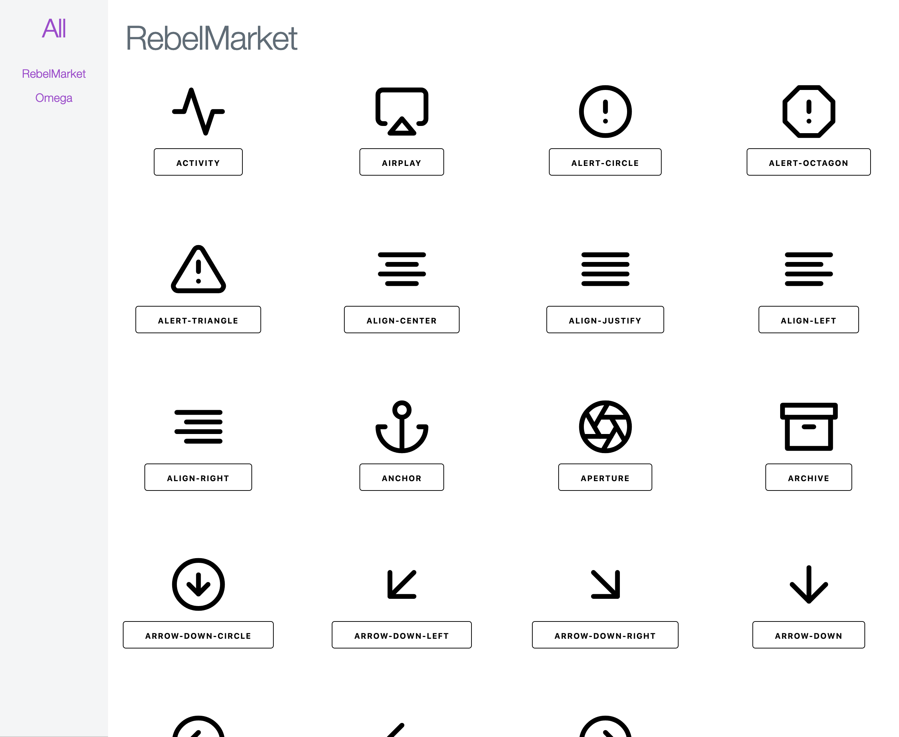

# Iconer


Iconer lets you manager your svg icons without depending on any external service in a simple web interface.
You just add Iconer as a dev dependency to your project and you can manage your icons.



## Installation

If [available in Hex](https://hex.pm/docs/publish), the package can be installed
by adding `iconer` to your list of dependencies in `mix.exs`:

```elixir
def deps do
  [
    {:iconer, "~> 0.1.1-alpha", only: :dev}
  ]
end
```

Documentation can be generated with [ExDoc](https://github.com/elixir-lang/ex_doc)
and published on [HexDocs](https://hexdocs.pm). Once published, the docs can
be found at [https://hexdocs.pm/iconer](https://hexdocs.pm/iconer).

## Setup

```elixir
config :iconer, :sets, [
  %{
    name: "RebelMarket", # Name of an icon set
    path: "examples/rebel" # Path to an icon set
  },
  %{
    name: "Omega",
    path: "examples/omega"
  }
]
config :iconer, :port, 4545 # (optional: default port is 1212)
```

## Todo

- [ ] Add filtering
- [ ] Add import
- [ ] Add updating
- [ ] Add deletion

## Attributions

- Example icons from [Feather icons](https://github.com/feathericons/feather)
- [Milligram minimal CSS framework](https://milligram.io/)
